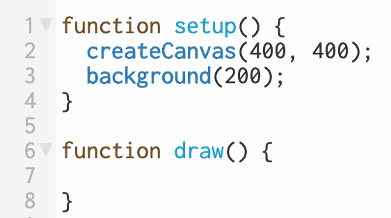

# p5workshop
For Processing Community Day Copenhagen 2020

## Useful links
- The p5 online editor: [editor.p5js.org](https://editor.p5js.org/)
- p5 reference: [p5js.org/reference](https://p5js.org/reference/)

### Youtube channels
- [The Coding Train](https://www.youtube.com/playlist?list=PLRqwX-V7Uu6Zy51Q-x9tMWIv9cueOFTFA)
- [Kreativ Kodning](https://www.youtube.com/channel/UCRSqTiVe7Rho95hNtd3hJBQ/playlists) (in Danish)

## Troubleshooting - What to do if you're stuck?
1. Discuss with your coding partner.
2. Consult [the cheat sheet](cheatsheet.pdf).
3. Look up the examples and documentation at [p5 reference](https://p5js.org/reference/)
4. Search for videos (the two channels above are good places to look).

# 1. Create your own masterpiece

## Exercises

### 1.1 Setting up and choosing background color
- Log in to the p5 editor using a Google or Github account. Or create an account if you have neither of those.
- Choose a canvas size fitting your tastes and screen size.
- Make the background a dark shade of gray.
- Make the background yellow.
- Make the background your favorite color.

This [Color picker](https://www.google.com/search?q=color+picker) might be helpful.

### 1.2 Points, stroke, and stroke weight
- Put a large, green dot at the upper right part of the canvas.
- Create a small group of dots (3-4 is fine) of different sizes and colors at a region of the canvas of your choice. They should have coordinate sets close to each other, but not identical.

### 1.3 Lines
- Draw an 'X' on the lower left of the canvas by drawing two lines crossing each other. The colors and line widths are up to you.

### 1.4 Rectangles
- Make a rectangle with stroke and fill colors of your choice so that it does no overlap the group of dots from exercise 1.2.
- Make a rectangle that frames the group of dots. Make sure it has no fill.

### 1.5 Circles and ellipses
- Draw a circle with red outline and orange fill.
- Draw an ellipse with a height that is twice its width.
- Draw an ellipse such that it encases the rectangle from the exercise 1.4. Make sure it has no fill.

###  1.6 Doing your own research
- Find the triangle command on the cheat sheet. How do you think it works?
- Draw some triangles using the command. Both with and without fill.
- Imagine you have a burning desire to add a drawing of pac-man to your sketch!
- Search for the command 'arc' on the p5 reference web site.
- Check the examples and read the documentation. Use the information to draw a big yellow pac-man on the canvas :D

## Finally, create your own piece of abstract art
Use what you've learned to compose a work of your own. Use the examples below, either as inspiration, or choose one to recreate. You may want to start a new sketch for this, or you can continue 

[A collection of inspiring works of art](https://docs.google.com/presentation/d/e/2PACX-1vTOWjpHnjLNllezpdzjXKan4EI-zMAwuV4N_PcARcsQja_aY5P1p5fRPr2v82uxmYgFGSlULZ5jtFWd/embed?start=false&loop=false&delayms=3000&slide=id.g3f70b3232d_0_27) - *Compiled by Esther Hersh*

**When you're done, send the link to your sketch to p5workshop2020@gmail.com - I will make a gallery of the contributions**

# 2. Interaction using built-in variables

## Exercises

### 2.1 Width and height of canvas
- Use the built-in width and height variables to draw a circle centered at the middle of the canvas.
- Changes the size of the canvas in the createCanvas command, and check that the circle is now drawn at the new center.

### 2.2 Clicking the mouse

- Move the background command from draw to setup, so that the draw function is empty (If in doubt, consult picture to the right) Consider what differences this will make.
- Add a mousePressed function to the sketch.
- In the mousePressed function, draw a dot at a random position on the screen. See the cheat sheet for how to generate random numbers for the coordinates. *Hint:* The width and height variables will come in handy.
- Try clicking the mouse :D

### 2.3 Using the mouse to draw
- This might work better in a fresh sketch, so feel free to save your work and start a new one.
- Draw a dot at the current mouse position.
- What happens if, instead of calling the background command in draw, you call it setup (i.e. only once)? 
- What happens if you give the stroke color some alpha? (If in doubt, see cheat sheet)
- Remove the alpha from the stroke color. Put the background command back into draw. Give the background color some alpha instead. What happens?
- Change the sketch, so that instead of a dot, a line from the previous mouse position to the current one is drawn.

# 3. Animation using variables

## Exercises

### 3.1 A moving circle
- Declare a variable x, and set it to zero.
- In the draw loop, draw a circle with an x component equal to the variable x.
- Also in the draw loop, add one to the x variable. What happens?
- What can be done to make the circle start outside of the canvas (to the left)?
- Use an 'if' statement to make the circle reenter the canvas (from the left) after leaving on the right side.

### 3.2 Random walk
- Define variables x and y.
- In the setup function - after creting the canvas - assign x and y values so they correspond to the middle of the screen.
- Similar to the previous exercise, in the draw loop draw a circle centered at (x, y).
- Also in the draw loop, add a random number between -2 and 2 to both x and y.
- Try changing the limits (-2 and 2) and see how this alters the behavior of the circle movement.

### 3.3 Mouse seeker
- Consider the code from the previous exercise. Remove the lines where the random numbers are added to x and y.
- Instead, compare x to the mouse's x position: Use conditionals to move the circle 1 pixel closer to the mouse in the x direction. *Hint*: The 'if' ... 'else' pattern may be helpful here. Alternatively, two 'if' statements can be used.
- Do the same comparison between y and mouseY and change y accordingly.
- Watch as the circle eerily homes in on the cursor.

# 4. Images
[Start with this sketch](https://editor.p5js.org/kwichmann/sketches/q_v3Mu06)

## Exercises

### 4.1 Displaying images
- Open the file tab (arrow next to sketch), and inspect the names of the picture files.
- Choose one of the files names, and write it in the quotes of the loadImage command.
- Display the image on the canvas - you choose where.
- Change the size of the picture.
- Change the color of the picture by tinting it.
- Search the p5 reference for the 'filter' command, and try applying a filter to the image.
- Do the same for the 'imageMode' command.

### 4.2 DVD logo challenge

- Remember the bouncing DVD logo? Time to revisit it :)
- Choose one of the images to use as the logo. Make sure it is resized so it's not too big compared to the canvas.
- Declare and initiate variables for coordinates (x, y) and velocity (dx, dy) of the "logo".
- Update the position of the logo in the draw function, adding dx to x, and dy to y.
- Use conditionals to check if the logo hits a border - In that case make it bounce by reversing the velocity in the relevant direction. You need to check both x and y directions.
- Finally, change to tint of the image randomly when the image bounces.

### 4.3 Make your own
- Find an image online and upload it to your sketch. Transparent png files work best.
- Display the image on the canvas.
- Make the way the image display mode interactive, whether through mouse or keyboard input.

# 5. Sound

[Start with this sketch](https://editor.p5js.org/kwichmann/sketches/0fBDR4iE) - Do note, that the functionality is from the [p5.sound library](https://p5js.org/reference/#/libraries/p5.sound)

The song "Circle" by the band [Fail to Die](https://www.facebook.com/fail2die/) (whom, I may add, have a particularly charming guitar player) is already added to the sketch and loaded into a variable.

## Exercises

### 5.1 Playing sounds
- Start playing the song by adding a command to the setup function.
- Set a playback rate for the song. What happens if it's greater than one? Smaller than one? Negative?
- Make the playback volume and/or the sound panning depend on the position of the mouse.

### 5.2 Add your own
- Find a sound file and upload it to one of your sketches.
- Add sound to the sketch.
- Add an interactive element to the playback.

## **Remember: Send the links for your cool sketches to p5workshop2020@gmail.com**
